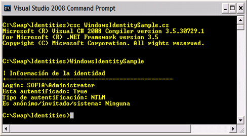
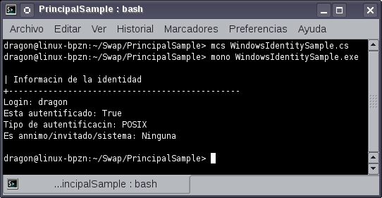
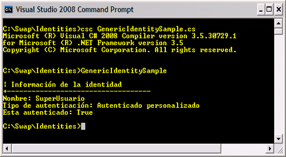

# Conceptos Básicos de seguridad en .NET (parte I)

La seguridad es un tema que debe estar presente desde el comienzo del diseño de todo sistema de información, más aún si este sistema será utilizado por usuarios desde Internet. Dos conceptos básicos para entender la seguridad de los sistemas es la autenticación y la autorización.

<h3>Autenticación</h3>

La autenticación es el proceso mediante el cual el sistema identifica y válida que el usuario pruebe quién dice ser, es similar a cuando hacemos una visita a un edificio y un guardia de seguridad en la entrada nos solicita una credencial para que nos identifiquemos, el mecanismo de credenciales más usadas en los sistemas de información es el login y el password. Entonces en definición la autenticación es el mecanismo que se refiere a probar y validar quiénes somos dentro del sistema, esta identidad consiste generalmente del login de usuario y del rol asociado con ese login, NET proporciona los siguientes mecanismos de autenticación:

<b>Windows Authentication</b> Utiliza la seguridad del sistema operativo windows y compara las credenciales (login y password) con las credenciales de Windows una vez identificado, windows utiliza un número de 96 bits llamado SID (security identifier) para identificarlo.

<b>Passport Authentication</b> En este tipo los usuarios utilizan sus cuentas de Hotmail o de Windows Messenger para autenticarse y por ende su servicio de registro en caso de no tener una cuenta passport, para utilizar esta autenticación es necesario descargar e instalar Passport SDK desde Microsoft Passport Network.

<b>Forms Authentication (ASP.NET)</b> Aquí se realiza mediante un formulario solicitando el login y el password al usuario, cuando ASP.NET válida las credenciales como correctas crea una cookie encriptada que se adjunta a cada respuesta de petición, por eso se dice que esta autenticación es basada en token (token-based), si el runtime de ASP .NET no encuentra la cookie entonces redirige al usuario a la pantalla del login, este tipo de autenticación es la más personalizable y portable que las anteriores.

Estos mecanismos se utilizan en conjunto con la seguridad basada en roles de .NET (role-based security) que se fundamenta en dos conceptos importantes: identidades y principales.
La identidad de un usuario está representada en .NET por los siguientes tipos de identidades que se encuentran representadas en el Framework por clases que implementan la interfaz IIdentity.

<b>Windows identity</b> Se basa en los métodos de autenticación soportados por el sistema operativo Windows, esta identidad tiene la propiedad de hacerse pasar por otro usuario con la característica de impersonation(suplantación) además de ser una forma muy segura de autenticar usuarios.

<b>Generic identity</b> Se basa en un método personalizado de autenticación que se define a nivel aplicación, al ser un método personalizado por lo tanto no depende de las características del sistema de seguridad de Windows.

<b>Passport identity</b> Utiliza la autenticación del modulo de Passport de Microsoft donde los usuarios utilizan las credenciales de Hotmail o Windows Live para acceder a cualquier sistema que implemente el servicio Passport (single sign-inservice).

Si bien se recomienda utilizar los mecanismos proporcionados por el framework, .NET permite también crear mecanismos personalizados de autenticación implementando la interfaz IIdentity.

Al ejecutarse el programa mostrará la siguiente salida en Microsoft Windows:

Y la siguiente salida al ejecutarse en Linux utilizando Mono

Al ejecutar el programa <i>GenericIdentitySample</i> mostrará la siguiente salida en Microsoft Windows:

